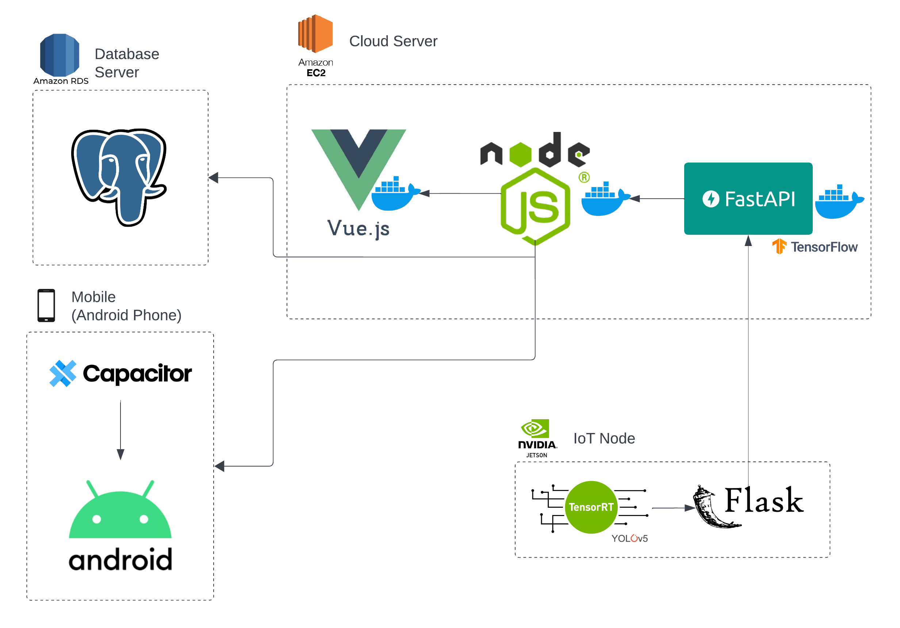
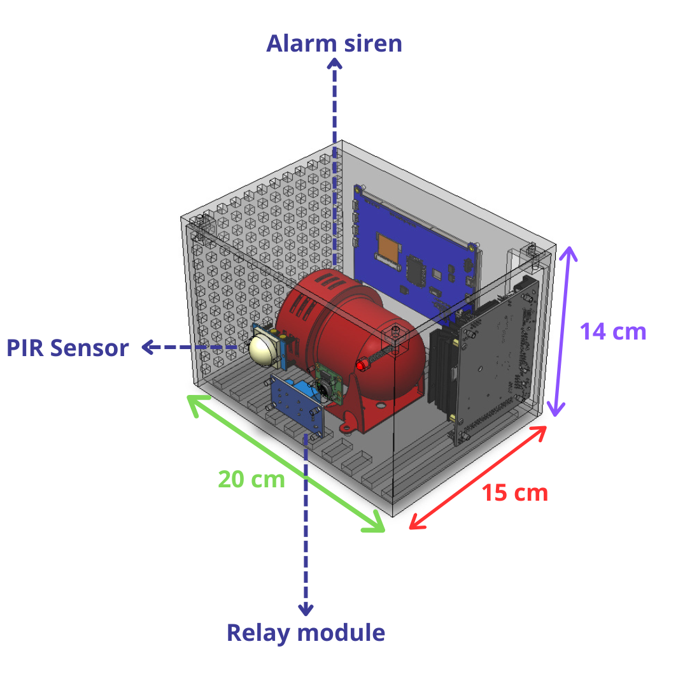
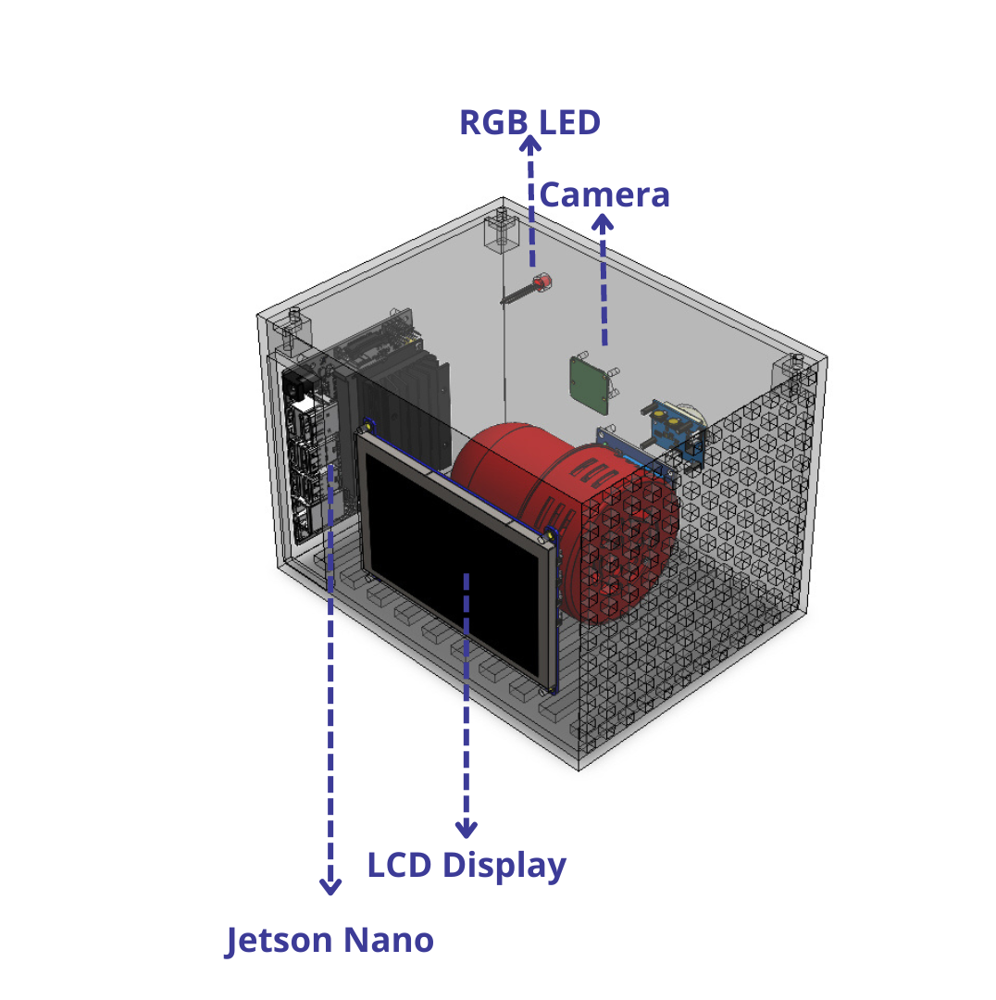
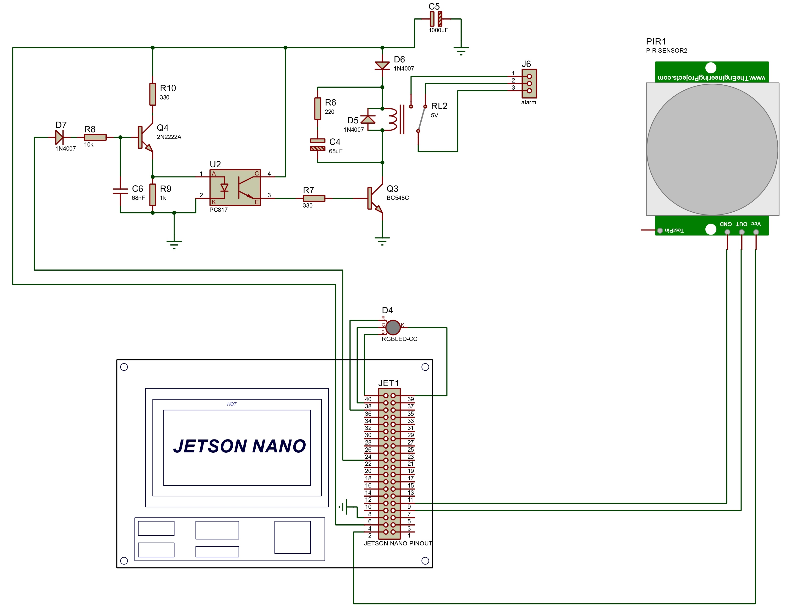
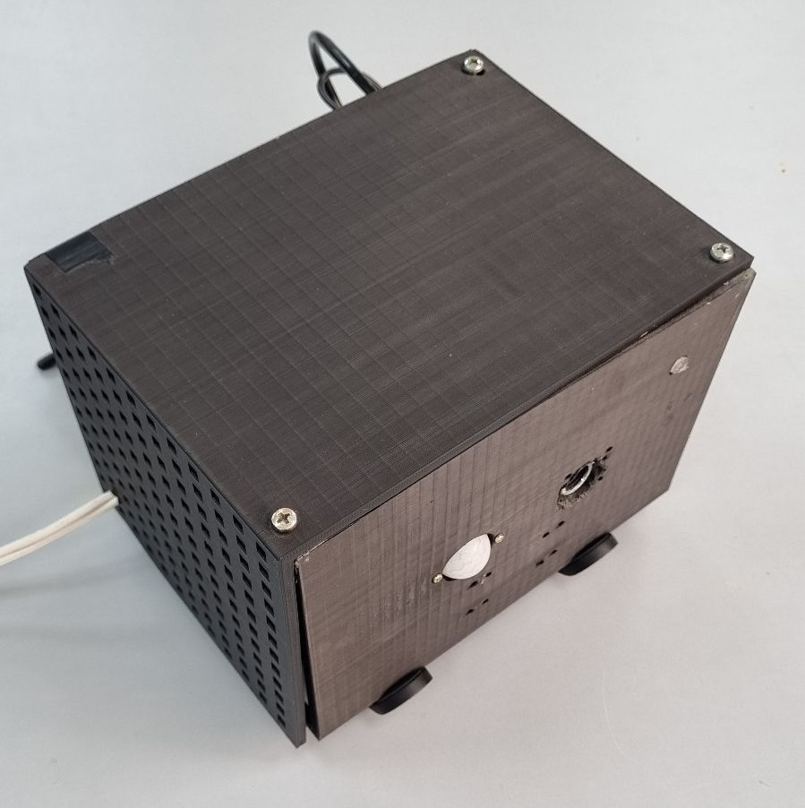

# Distributed Intelligent Video Surveillance for Early Armed Robbery Detection based on Deep Learning

📖 Paper: Fernandez-Testa, S. and Salcedo, E., 2024. [Distributed Intelligent Video Surveillance for Early Armed Robbery Detection based on Deep Learning](https://arxiv.org/abs/2410.09731). Proceedings of the [37th SIBGRAPI Conference on Graphics, Patterns and Images](https://sibgrapi.sbc.org.br/2024/).

## Overview 

This repository contains the final code for a distributed IoT system that detects weapons and classifies potential threats. The system utilizes multiple end-devices equipped with computer vision and object detection capabilities to constantly monitor for firearms and sharp weapons.

Here's how it works:

1. **Weapon Detection:** End-devices use a Yolov5 neural network to detect firearms and sharp weapons.
2. **Armed Robbery Classification:** Upon weapon detection, the end-device sends a series of frames to a cloud server. This server uses a 3DCNN to classify the scene as either a robbery or a normal situation, minimizing false positives.

In addition, this repository provides a web app and a mobile app for interacting with the system. You can find the complete code for deploying the models on an IoT node hosted on a Jetson Nano [here](https://github.com/Rod5919/Weapon-detector). 

<p align="center">
    
</p>

## Repository Structure

The project's repository is divided into four main components: 
- [`AI`](https://github.com/Coding-Rod/crime_detection/tree/main/ai) contains the code for deploying the weapon detection system (based on Yolov5) to an end device. This includes Dockerfiles and other necessary resources. 
- [`Backend`](https://github.com/Coding-Rod/crime_detection/tree/main/backend) houses the server-side code, which is built using Node.js and FastAPI. This component also includes the trained 3DCNN model for threat classification. 
- [`Frontend`](https://github.com/Coding-Rod/crime_detection/tree/main/frontend) contains the code for the web application's user interface, developed using Vue.js.
- [`Investigation`](https://github.com/Coding-Rod/crime_detection/tree/main/investigation) includes the notebooks, models, and reports generated during the research and development phase of the project.

Each component has its own set of dependencies due to variations in the libraries used. Please install the dependencies for each component separately by following the instructions in the README.md file located in each respective folder.

## Hardware

The design of the end devices prioritizes two main goals:

- Monitoring diverse environments: The devices are designed to effectively monitor both public and private spaces.
- Edge computing: Deep learning pipelines are embedded directly into the devices, bringing processing power closer to the source of data.

| **3D Design (Frontal)**  | **3D Design (Posterior)** | 
|-----------|-----------|
|  |  |

| **Schematics**  | **Prototype** | 
|-----------|-----------|
|  |  |

## Datasets

Find below the three datasets prepared for the present project: 

1. Weapon Detection Dataset: It contains guns and knives of variable dimensions. This dataset will be shared on request. 
2. [Armed Robbery Detection](https://drive.google.com/file/d/1Z_B09R4UONPpkRVynjnxuIt8C7dLPNpc/view?usp=sharing): It contains videos of armed robberies and normal situations, all with a resolution of 224x224.
3. [Simulation dataset](https://drive.google.com/drive/folders/18_gmn4qohngT7pbf0JBTlW7DemHEBowp?usp=sharing): It has videos with situations similar to real armed robberies. This dataset was used to test the performance of the entire system. 

## Citation

If you find this work useful for your research, please consider citing this paper:

```
@inproceedings{fernandez-testa2024,
title = {Distributed Intelligent Video Surveillance for Early Armed Robbery Detection based on Deep Learning},
author = {Fernandez-Testa, Sergio and Salcedo, Edwin},
booktitle = {Proceedings of the 37th SIBGRAPI Conference on Graphics, Patterns and Images},
year      = {2024}
}
```

## Miscellaneous

Please send any questions you might have about the code and/or the framework to [Sergio Fernandez-Testa](mailto:sergiorodrigofernandeztesta@gmail.com).
Any code taken from online repositories includes a copyright claim at the top of the script.
